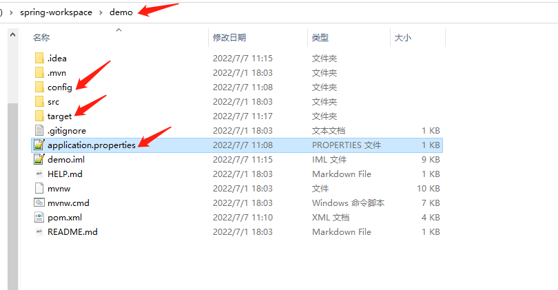
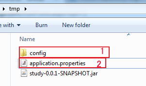
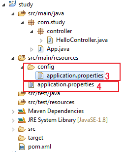

https://gitee.com/huadahua/spring-properties-2206.git

https://gitee.com/huadahua/spring-test-2206.git

#### 外部properties文件

- 将属性外置到属性文件中，可以将属性提取到applicaton.properties中，也可以提取到其他自定义属性文件中，而SpringBoot会自动查找application.properties文件，并将其中属性加载到Spring 环境中。

- application.[properties](https://so.csdn.net/so/search?q=properties&spm=1001.2101.3001.7020)一共有四个目录可以放置：

  ```java
  1. /config 工作文件夹的子级文件夹
  2. 工作文件夹
  3. config  在classpath中的config包
  4. classpath根目录
  ```

  

  ```java
  优先级从高到低为：1 2 3 4，即查找顺序按照优先级顺序查找，
  
  级别高的配置会覆盖级别低的相同配置，级别高的配置没有的项，级别低有的项会同样生效。
  
  也就是说，无论级别高低，配置都会生效，只是相同的配置被级别高的配置覆盖
  ```

- 案例：

  ```java
  1. 在classpath的resource下创建config目录，添加属性文件application.properties,并添加以下属性值
  	server.port=8081
  2. 在resource下的application.properties中添加以下属性
  	server.port=8070
  	server.servlet.context-path=/example4
  	
  	启动服务器，观察端口号和context-path的值，应为  8081   example4
  3. 在当前项目下创建文件application.properties，添加属性：
  	server.port=8020
  	server.servlet.context-path=/example2
  	
  	启动服务器，观察控制台的端口号和context-path的值，应为：8020   example2
  	
  4. 在当前项目下创建目录config，并创建application.properties,添加属性：
  	server.port=8060
  	server.servlet.context-path=/example1
  	
  	启动服务器，观察端口号和context-path的值，应为：8060  example1
  ```

  

  ```java
  1和2适用于生成环境，打包后由于发布包不能修改，配置文件放在发布包之外，可以很方便的配置。
  
  - 开发过程中创建的config目录以及application.properties文件，会在项目工作空间中可以找到，如果部署项目，可以将其部署到以下位置
  ```

  

  

  

  ```java
  3和4适用于开发环境，位置如下：
  ```

  

  如果同时在四个地方都有配置文件，配置文件的[优先级](https://so.csdn.net/so/search?q=优先级&spm=1001.2101.3001.7020)是 1 > 2 > 3 >4

  - 注意：

    ```java
    通过打包，可以确定classpath包括：java,resources,和lib（maven依赖包）
    ```

- https://gitee.com/huadahua/spring-properties-2206-hascontent.git

- Spring Environment会从以下三个属性源提取属性：

  ~~~java
  JVM系统属性
  系统环境变量
  java属性文件
  ~~~

- 如何从自定义属性文件读取

  - 使用注解@ProperSource注解指定属性源位置

    ~~~java
    @SpringBootApplication
    @PropertySource("classpath:config/myapp.properties")
    @PropertySource("file:config/myapp2.properties")
    public class SpringPropertiesTest2206DemoApplication {
    
    }
    
    若自定义属性文件在classpath下，使用上述第一种；若属性文件不在classpath下，用file指向，表示在当前项目路径下查找，不要加/，表示相对当前路径
    
    classpath可以省略，file不可以省略
    ~~~
    

#### Profile

- @Profile: Spring为我们提供的可以根据当前环境，动态的激活和切换一系列组件的功能；

  ~~~java
  在不同的环境中，通常会使用不同的配置文件，不同的Bean，比如开发环境develop、测试环境test、生产环境master中使用的数据源不一样，使用的配置文件不一样，此时可以通过该注解标明哪个配置文件，哪个Bean适用于哪种环境，当对应的环境被激活时，对应的配置，对应的Bean生效，否则不生效。
  
  @Profile:指定组件在哪个环境的情况下才能被注册到容器中，
  运行时启用哪种环境，对应的组件被激活
  
  
  该注解可以在类上方（通常是配置类），也可以作用于方法上方，通常是@Bean注解的方法
  
  配置类：
  	@Configuration
      @Profile("dev")
      public class DevConfig {
      }
  
  	@Configuration
      @Profile("test")
      public class TestConfig {
      }
  
  在配置文件中激活：
  	spring.profiles.active=dev
  ~~~

- 通常属性文件也会按照profile建立，需要注意的是属性文件名称中的名称需要和profile中的值保持一致，则什么环境加载对应的属性文件

  ~~~java
  application-{profile}.properties
  ~~~

- yaml文件

  - 注意：Spring框架和@PropertySource并不支持yaml配置文件

- SpringBoot属性选择优先级

  ~~~java
  。。。
  1. Profile特定应用程序属性
  2. 应用程序的properties/yml
  3. @PropertySource文件
  。。。。
  
  以上是读取顺序，且从上到下优先级也是从高到低
  优先级高的文件中的属性会覆盖优先级低的文件中的属性
  ~~~

  

#### Spring表达式 -- 了解即可

- 可以从Environment中读取属性
  - @Value(#{environment['daily.limit']})等效于  @Value("${daily.limit}")
- 访问Bean的属性
  - #{XXBean.xx}


#### 测试

1. 介绍分类：

   1. 单元测试   

      ~~~java
      用于测试一个功能单元，用于测试业务层的(不带持久层)，不需要使用Spring容器
      ~~~

   2. 集成测试  

      ~~~java
      用于测试多层，测试业务层+持久层属于集成，测试控制器+业务层+持久层也是属于集成测试。通常集成测试都需要使用SPring容器
      ~~~

2. Junit5 测试

   1. ~~~java
      从SpringBoot2.2版本开始的默认JUnit5
      需要Java8环境，可以使用lambda表达式
      ~~~

   2. Junit5常用测试注解

      ~~~java
      @Test - 放在测试方法上方，可以直接启动该方法
      @BeforeEach -- 作用于测试方法上方，表示在每个测试方法执行之前都会调用该方法
      @AfterEach -- 作用于测试方法上方，表示在每个测试方法执行之后都会调用该方法
      @BeforeAll  -- 作用于方法上方，表示在所有测试方法执行之前执行，且只执行一次，要求该方法为static
      @AfterAll  -- 作用于方法上方，表示在所有测试方法执行之后执行，且只执行一次，要求该方法为static
      ~~~

   3. 断言库 -- 自动化测试

      ~~~java
      作用:预判结果
      1. 静态导入断言库
          import static org.junit.jupiter.api.Assertions.*;
      2. 方法：
          assertEquals(expect,actual)
          assertNull(result)
          assertNotNull(result)
          assertTrue(result)
          assertFalse(result)
          assertThrows(Exception.class,()->{})
      ~~~


   #### 项目中功能单元测试 -- mock测试--模拟测试

   ~~~java
   Mock：模拟
   如果不想让对业务层的测试对数据库的真实数据造成影响，此时可以采用mock测试，可以对持久层对象进行模拟并训练，从而解决对数据库的影响问题。
   ~~~

   - mock测试使用的步骤

     ~~~java
     1. 静态导入模拟库
         static org.mockito.Mockito.*;
     2. 获取模拟对象
         mock(Class) -- 得到对应的mockBean对象
     3. 对mock Bean进行训练
         when(userDao.addUser(User)).thenReturn(1);
     4. 进行单元测试，根据训练的结果进行一些自动化测试（断言）
     ~~~

3. Spring集成测试

   1. 为测试环境提供了ApplicationContext对象，但是数据源这些Bean都需要手动配置--了解

   3. 使用：

      ~~~java
      在测试类上放添加注解
      	@ExtendWith(SpringExtension.class)
      	@ContextConfiguration(classes = Config.class)
          
      或者
          @SpringJUnitConfig(Config.class)
          
      则可以使用上下文对象，也可以注入对象，直接使用。
      ~~~
      
   4. 注意点：脏上下文

      ~~~java
      测试过程中，如果需要，可以在某个测试方法结束后，选择关闭上下文，使用注解@DirtiesContext即可，其他测试方法执行时，会重新获取新的上下文对象
      ~~~
   
4. SpringBoot集成测试

   1. ```
      SpringBoot进行集成测试，使用注解@SpringBootTest即可，无需指定配置文件，其他操作和Spring集成测试一致。
      ```

   2. 添加依赖：

      ~~~java
      <dependency>
          <groupId>org.springframework.boot</groupId>
          <artifactId>spring-boot-starter-test</artifactId>
          <scope>test</scope>
      </dependency>
      ~~~

      - 业务层+持久层的集成测试
      - 三层集成测试

5. SpringBoot中的web测试--3种方式：

    1. TestRestTemplate集成测试 - 启动web容器

        ~~~java
        1. SpringBoot测试框架会自动启动内嵌服务器
        2. 通过SpringBoot自动配置的TestRestTemplate Bean对象来发起请求
            - 发送get请求，调用方法 getForObject(....)
            - 发送post请求，调用postForObject(.....)
        3. web集成测试的时候，webEnvironment支持以下模式
            RANDOM_PORT, DEFINED_PORT, MOCK, NONE
        ~~~

        注意点：

        ~~~java
        @Test
        public void registTest(){
            //定义相对路径
            String url = "/users/regist";
            //post请求传参，参数必须是MultiValueMap类型
            MultiValueMap<String,Object> map = new LinkedMultiValueMap<>();
            map.add("userName","张三");
            map.add("pwd","123");
            //发起post请求
            String mes = template.postForObject(url,map,String.class);
            assertEquals("注册成功！",mes);
        
        }
        
        @Test
        public void loginTest(){
            //定义请求的相对路径
            //get请求传参是在请求后通过？拼接参数
            String url = "/users/login?userName={username}&pwd={password}";
            String mes = template.getForObject(url,String.class,"tom","123");
            assertEquals("登录成功！",mes);
        }
        ~~~

        

    2. MockMVC  

        1. 特点：
                1. 会启动spring容器
                    2. 不会启动web容器
                    机制：模拟发起请求，不需要启动web容器，同时可以使用Spring容器

        2. 模拟发起请求需要做的事情

            ~~~java
            1. 在测试类上方的@SpringBootTest注解中添加属性webEnvironment，指定进行mock测试，并添加注解@AutoConfigureMockMvc
            2. 导入模拟请求构建相关的包 -- static导入
            3. 导入结果匹配相关的包 -- static导入
            4. 在测试类中注入MockMVC这个Bean对象
            5. 使用MockMvc来发起请求
            ~~~

            

        ~~~java
        1. 静态导入
        import static org.springframework.test.web.servlet.request.MockMvcRequestBuilders.*;
        import static org.springframework.test.web.servlet.result.MockMvcResultHandlers.print;
        import static 
        org.springframework.test.web.servlet.result.MockMvcResultMatchers.*;
        
        
        发送get请求
        mockMvc.perform(get("/users/login?userName={username}&pwd={password}","tom","123"))
                        .andExpect(status().isOk())
                        .andExpect(content().string("登录成功！"));
        //                .andDo(print());  //打印调试信息
        
        发送post请求
        传参类型必须为MultiValueMap类型
        	@Test
            public void registTest() throws Exception {
                MultiValueMap<String,String> map = new LinkedMultiValueMap<>();
                map.add("userName","lily");
                map.add("pwd","333");
                mockMvc.perform(post("/users/regist").params(map))
                        .andExpect(status().isOk())
                        .andExpect(content().string("注册成功！"))
                        .andDo(print());
        ~~~

        

    3. Web分片测试--- 分片测试，上下文只初始化指定得控制器依赖，模拟其他bean，单独测试控制器

        1. 以上两种对mvc的测试均为集成测试

            ~~~java
            TestRestTemplate -- 集成，启动web容器，启动spring容器
            mockmvc测试 -- 集成，不启动web容器，启动spring容器
            web分片 -- 仅仅用于测试控制器的
                特点：web分片测试可以指定测试的控制器是谁，后续spring只会装配该控制器以及相关的依赖项
            ~~~

            

        ~~~java
        同样使用模拟请求，所以静态导入mockmvc的包2个
        以及这里会进行模拟业务层，可以使用Mockito下的when，也可以使用given，given所处的包为：
        import static org.mockito.BDDMockito.*;
        
        @WebMvcTest(UserController.class)
        public class WebSliceTest {
            @Autowired
            MockMvc mockMvc;
        
            @MockBean
            UserService userService;
        
            @Test
            public void registTest() throws Exception {
                given(userService.regist("lisa","123")).willReturn(new User(8,"lisa","123"));
                //模拟请求
                MultiValueMap<String,String> map = new LinkedMultiValueMap<>();
                map.add("userNmae","lisa");
                map.add("pwd","123");
                mockMvc.perform(post("/users/regist").params(map))
                        .andExpect(status().isOk())
                        .andExpect(content().string("注册成功！"))
                        .andDo(print());
        
            }
        }
        ~~~

        


